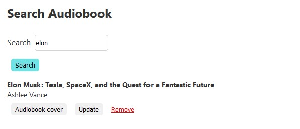
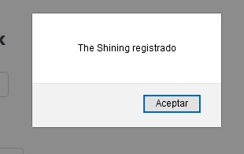
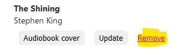
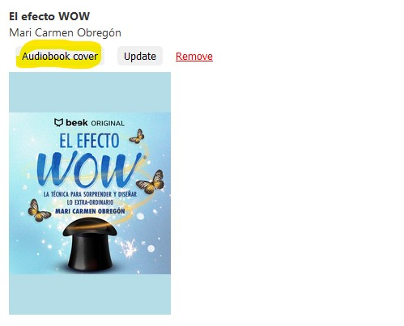
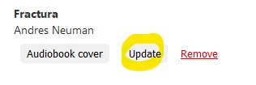
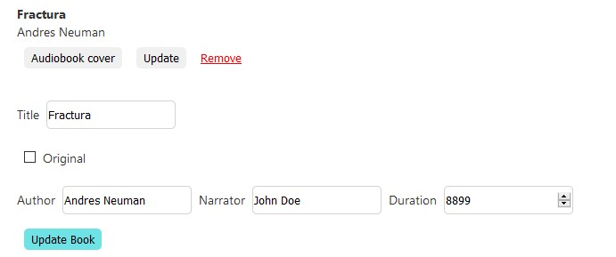

# Junior Beek Frontend Challenge
This is a simple `React JS` app that lets you:

- Search Audiobooks and display the results.
- Add a new Audiobook to the list.
- Update an Audiobook from the list.
- View the list of all current Audiobooks.
- Remove an Audiobook from the list.

Clone the repository

`git clone https://github.com/alebrij3/beek-api.git`

Go inside the directory where you cloned the repo and install it

`yarn install`

Then run `yarn start`

Open localhost:3000 on your web browser

## Search

Write the search query into the input and press / tap "Search"

## Add Audiobook

Fill in the fields and then press / tap "Add Audiobook"

You'll see an alert with the book title

## Remove Audiobook

To remove the Audiobook press/tap the "Remove" text

## List All Audiobooks

Press/tap "Get All Books"

## Audiobook Info

When you click on "Audiobook cover" it shows the Image corresponding to the cover of the Audiobook. We are working on displaying all the Audiobook info.

## Update Audiobooks

Click/tap on "Update"

You will see a form pre-filled with the info of the Audiobook you are about to update

When you are done, just click the "Update Book" button

## Missing stuff

You can check what's missing in this project's <a href="https://github.com/alebrij3/beek-api/issues/">Issues</a>