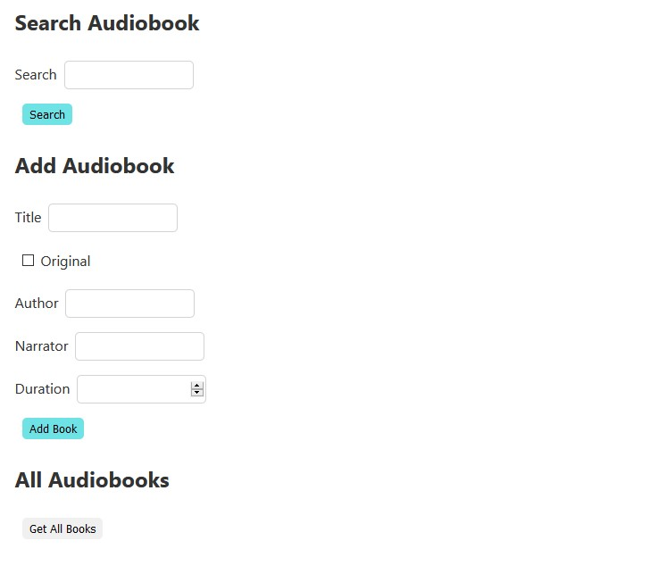

# Junior Beek Frontend Challenge
This is a simple `React JS` app that lets you:

- Search Audiobooks and display the results.
- Add a new Audiobook to the list.
- Update an Audiobook from the list.
- View the list of all current Audiobooks.
- Remove an Audiobook from the list.

Clone the repository

`git clone https://github.com/alebrij3/beek-api.git`

Go inside the directory where you cloned the repo and install it

`yarn install`

Open localhost:3000 on your web browser

## Missing stuff

You can check what's missing in this project's <a href="https://github.com/alebrij3/beek-api/issues/2">Issues</a>